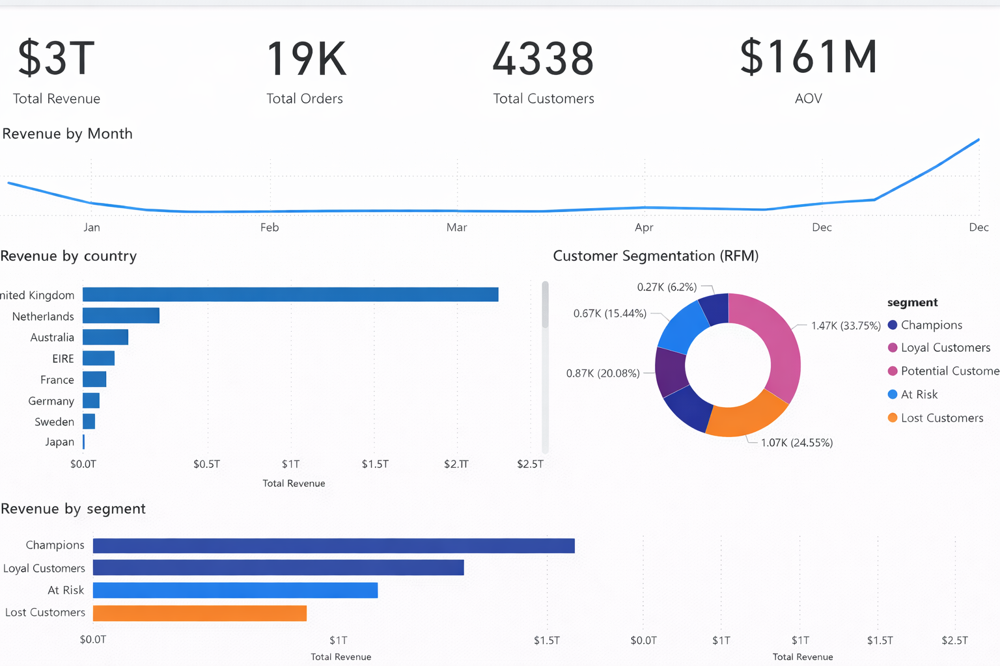

# 📊 E-Commerce Sales & Customer Analytics

## 📌 Project Overview
This project analyzes e-commerce transactional data to understand sales performance, customer behavior, and customer segmentation using RFM analysis.

## 🛠 Tools & Technologies
- Python (Pandas, NumPy)
- SQL
- Power BI
- Jupyter Notebook

## 📂 Dataset
The dataset contains invoice-level transaction data including:
- Invoice No
- Invoice Date
- Customer ID
- Country
- Quantity
- Amount

## 🔧 Data Cleaning
- Fixed encoding issues in column names
- Converted numeric columns stored as text
- Handled missing values safely
- Created new feature: `total_sales`

## 📊 Exploratory Data Analysis (EDA)
- Total Revenue
- Total Orders
- Total Customers
- Average Order Value (AOV)
- Monthly revenue trends
- Country-wise revenue analysis

## 🧠 RFM Analysis
Customers were segmented using:
- Recency
- Frequency
- Monetary value

Segments include:
- Champions
- Loyal Customers
- Potential Customers
- At-Risk Customers
- Lost Customers

## 📈 Power BI Dashboard
The dashboard includes:
- KPI cards
- Monthly revenue trend
- Country-wise revenue
- Customer segmentation
- Revenue by segment

## 📊 Dashboard Preview

## 📌 Key Insights
- A small percentage of customers generate a large portion of revenue
- Champions and Loyal customers are the most valuable segments
- At-Risk customers indicate churn opportunity

## 📎 Files Included
- `ecommerce_analysis.ipynb`
- `cleaned_ecommerce_sales.csv`
- `rfm_analysis.csv`
- `dashboard.png`

## ✅ Conclusion
This project demonstrates end-to-end data analytics skills including data cleaning, analysis, visualization, and business insight generation.
